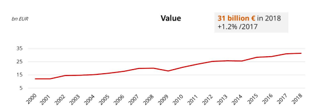
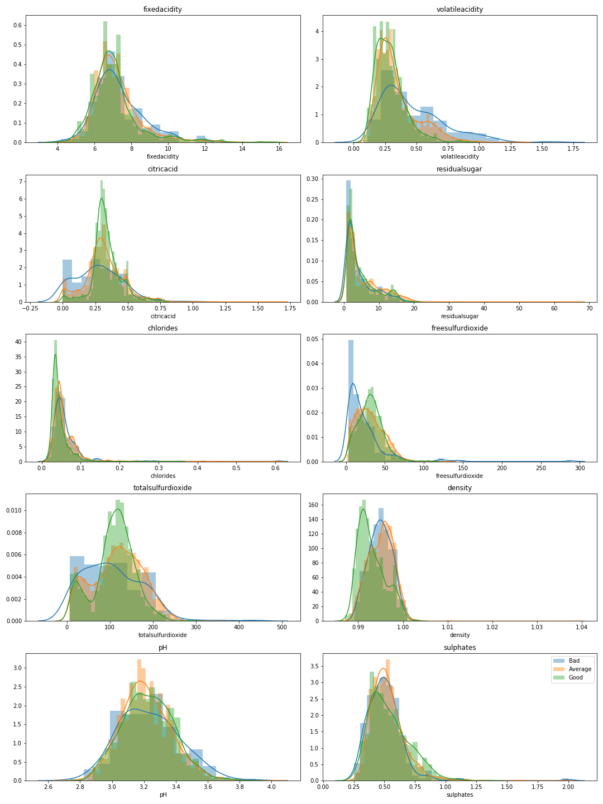
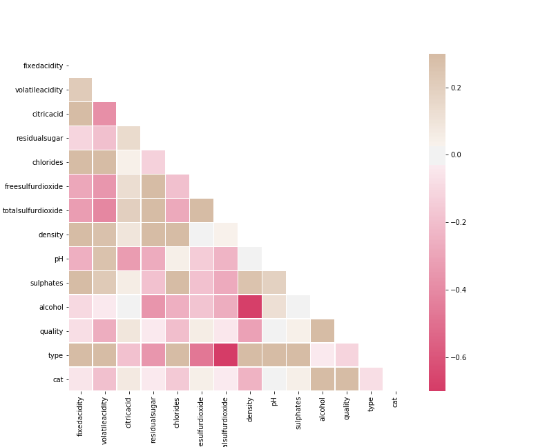

# Classifying Wine Qualities

Author - Aroa Gomez

### Repository Content

 - Classes .py files: [dataclean](dataclean.py), [models](models.py)
 - Notebooks:    
         - [Data_exploration](Data_exploration.ipynb): data analysis   
         - [Class_model](Class_model.ipybn): model specification and optimization    
         - [Type_class](Type_class.ipybn): wine or red wine prediction      
 - Presentation pdf:   
        - [Wine Quality & Machine Learning.pdf](Wine Quality & Machine Learning.pdf)
        
        
### Project Motivation 

The wine industry has kept growing steadily for the past 19 years and, as in any other growing industry, new players come to take part in it. The biggest wine producers in the world in 2019 were Italy, France, Spain and the USA. On the other hand we have the new players, China for instance is the largest grape producer reaching 11,7 tones in 2019.

  

> Source: OIV (International Organisation of Vine and Wine)

Every year new winemakers appear in the market trying to compete with well established brands, large beverage conglomerates and heavy marketing budgets. 

For those small business owners trying to make their way into a very competitive market trial and fail might not be the best approach. As traditional as the industry might seem, there is a strong innovation and technology drive to improve and adapt to modern times, especially for those joining the game now. 

We want to help those entrepreneurs with will and passion but little wine background. This product is to enable the young inexperienced wine tasters, winemakers and wine brokers to better choose and impartially identify different wine qualities avoiding the tasting and valuation cost and logistics. 

### Data Description:

> Source: Original Owners: Forina, M. et al, PARVUS - An Extendible Package for Data Exploration, Classification and Correlation. Institute of Pharmaceutical and Food Analysis and Technologies, Via Brigata Salerno, 16147 Genoa, Italy.
>Donor: Stefan Aeberhard, email: stefan '@' coral.cs.jcu.edu.au

Features:

The dataset is composed by 12 physicochemical wine attributes for about 6,500 wines of which 1,600 are red and 4,900 are white. 

- **fixed acidity**: fixed acids found in wines gives a sour taste. Acidity affects taste and pH, which affects color, stability to oxidation, overall the lifespan of wine.
 - **volatile acidity**: The amount of volatile acidity found in sound grapes is negligible. High content of volatile acidity refers to    vinegars (spoiled wine) but it's also used to add complexity to the wine
 - **citric acid**: it is added to wines as a stabiliser and to complement flavor or increase 'fresh' flavor.
 - **residual sugar**: residual sugar content from grapes, defines the wine sweetness, from dry (0-9 g/l) to sweet (+120 g/l)
 - **chlorides**: amount of salt in wine 
 - **free sulfur dioxide (SO2)**: prevents oxidation and microbial growth. It can give fruity taste but in high concentration can produce a sharp/bitter/chemical flavor 
 - **total sulfur dioxide(SO2)**: together with free sulfur dioxide can give a sense of how “clean” a wine is. If a wine has a free sulfur dioxide percentage of the total sulfur unusually small, it’s often an indication that the wine is chemically and/or microbially unstable.
 - **density**: density of wine is determined by the concentration of alcohol, sugar, glycerol, and other dissolved solids
 - **pH**: pH is a way to measure ripeness in relation to acidity. Low pH wines taste tart and crisp. PH level tells how intense the acids taste
 - **sulphates**: it's a preservative. It maintains color and flavor. Some believe that adding sulphates negatively affects wine flavor

### Multiclass Classification

Our target variable, wine rating, is a categorical variable in a range of 3-10, where 10 is very good wine and 3 is low quality wine. The categories will be divided into three classes for our analysis: 
Class 0: bad
Class 1: average
Class 2: good

It will be also tested for wine colour classification, 0 white wine and 1 red wine.

#### Data exploration

As mentioned above, our data represents physicochemical wine compositions which impact positively and negatively the taste, color, density, and cleanliness of the wine. 

When looking at the histogram for each class and each chemical we can observe the largest divergences for good wines in: citric acid; volatile acidity; chlorides; free SO2; total SO2 and density. This indicates possible explanatory power in these compositions to identify and classify different types of wine.

In the correlation matrix below, we can observe little correlation between the components. This roughly indicates that there won’t be multicollinearity issues in our data.

#### Data Modelling: Bad, Good or Very Good wine

Firstly, we observe largely unbalanced classes, with 77% observations in class 1 (average wine), 20% in class 2 (good wines) and 4% in class 0 (bad wines). In order to solve this we decided to apply SMOTE. SMOTE is an oversampling technique that generates synthetic samples.

**Baseline Model**

Our target variable (wine qualitilty class) is not just a category but also ordinal, meaning it has a clear ordering and the space between categories is not equal, the difference between category 0 and 2 is larger than between 1 and 2. This is wine for our base model we will use ‘Ordinal Classification’. The results indicates low precision for the minority classes (0.14 and 0.39 for class 0 and 2 respectively). We have 0.89 precision in class 1 where we have the most observations. 

**Modelling Techniques**

To improve the baseline model we will apply two techniques to choose the best fit out of five different classifier models:

**Model tuning**
- Voting Classifier
- Pipeline and GridSearchCV

**Classifiers**
- Logistic Regression for multiclass
- Random Forest
- KNN classifier
- Support Vector Machine
- Decision Tree

After tuning different parameters and testing our five models we concluded that the best fit is Random Forest classifier, with higher precision (class 0:0.26, class 1:0.88, class 2:0.64 ) and accuracy (0.80) for our three classes. 

The top three components (feature importance) to determine wine quality are: alcohol, free SO2 and volatile acidity. The former two features were also reflected and observable during our data exploration (histograms chart)

**Feature Engineering**

PCA analysis and interactions have been tested to improve the model accuracy but the results did not improve in comparison to our random forest classifier. 

#### Red or White wine

We want to be able to classify wine types by color, white or red. The accuracy and precision of each model is at 99%. This could be interpreted as these compositions holding enough information about our wines to identify its visual and tasting features.

### Client’s Data

A start-up wine broker has provided new data for twelve of its wines. These haven’t been evaluated by wine tasting experts so we won’t be able to compare the results. Although, some considerations arose from the chemical reports received. 

Since these comes from different winemakers and labs not every feature can be found on these reports, however, luckily the main characteristics are always present (alcohol, SO2, acidity, pH). 

In order to evaluate our first client product we retrained our models removing the features that couldn’t be collected in the reports. Random Forest performed as our initially selected model, therefore we are not losing classification power by removing two of our features.

### Conclusion and Limitations

- We can confidently estimate good/average wines for our potential clients but there is limited predictive power identifying very good or poor quality wines due to the large class imbalance in our data set.

- The model is dependent of previous winetaster ratings so it keeps some of the rating bias

- Not all types of wines are captured, sparkling and rose for instance can't be rated.

- Different clients and different labs reports will contain these features in slightly different manner or metrics, for implementation purpose these factors should be considered.

- Retraining models with different features seems to not lose accuracy in the model but different approach to deal with missing values could be considered.

- Collecting more data from different wine qualities and regions could considerably improve our model for class 0 and 2. 

